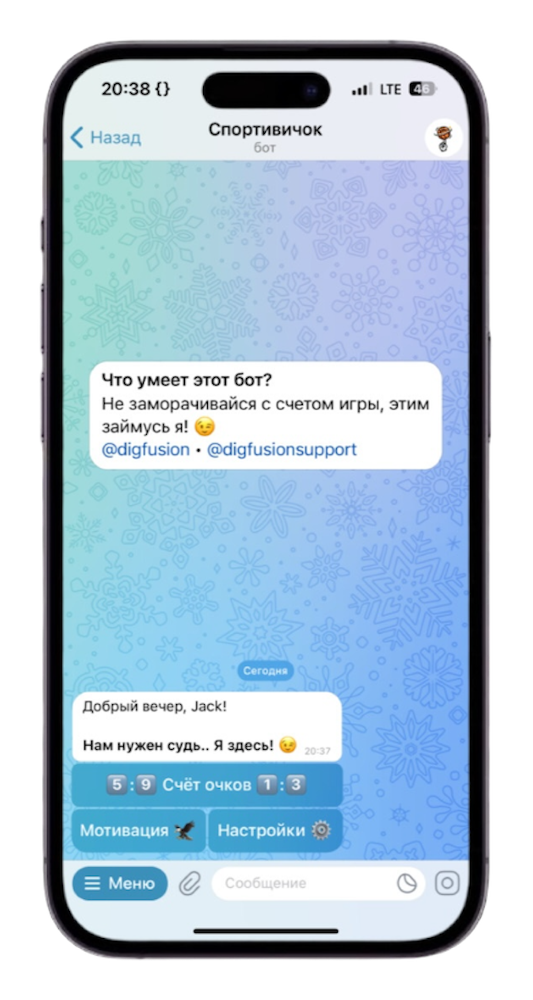
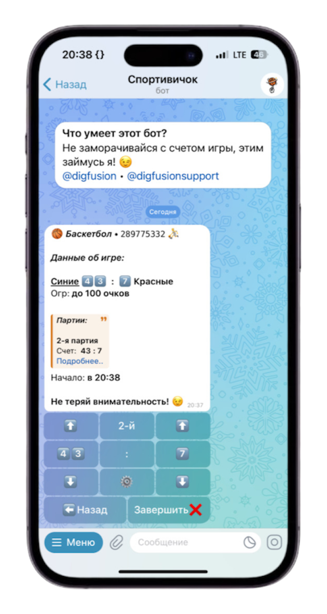

<h1>About</h1>
<h3>Personal judge for 4 different sports with fine settings</h3>

<h3>Focus on game <kbd>for free</kbd> with <i><a href="https://t.me/digjudgebot">digjudgebot</a></i></h3>

##

<h1>сontact us</h1>

<!--  -->

